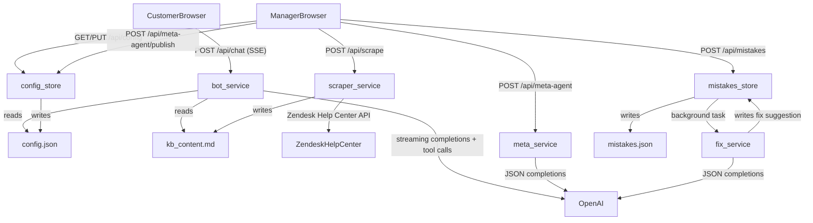

# Atome Card Support Bot

An AI-powered customer service chatbot for Atome Card, with a meta-agent management console for non-technical managers to configure, tune, and fix the bot without touching code.

- **Customer** — chats with the bot at `/`
- **Manager** — configures the bot at `/manager` (password: `atome2026`)

> **Live demo:** _link will be added before submission_

---

## Features

### Part 1 — Customer Bot

All Part 1 spec requirements are implemented:

- **KB-grounded answers** — the bot answers questions using the Atome Card Help Center knowledge base (`https://help.atome.ph/hc/en-gb/categories/4439682039065-Atome-Card`), scraped via the Zendesk Help Center JSON API and stored as markdown
- **Card application status** — when a customer asks about their card application, the bot calls a mock `getCardStatus` tool and presents the result as a structured status widget in the chat UI
- **Failed transaction status** — when a customer asks about a failed transaction, the bot asks for the transaction ID, calls a mock `getTransactionStatus` tool, and presents a structured widget
- **Manager config UI** — manager can edit the KB source URL (triggering a re-scrape), edit the additional guidelines, and toggle which tools the bot can use; changes take effect immediately
- **Mistake reporting** — customers can flag a bot mistake mid-conversation with a single click; the reported message and context are captured
- **Mistake dashboard** — manager sees all reported mistakes; an LLM automatically generates a fix suggestion for each (shown as a before/after diff); manager can apply the fix (which updates the guidelines) or dismiss it; all mistakes are archived in `applied` or `dismissed` buckets

### Part 2 — Meta-Agent

All Part 2 spec requirements are implemented:

- **Chat-based configuration** — manager describes the desired bot behaviour in plain English via a dedicated chat interface; no prompt editing required
- **Document upload** — manager can upload a PDF or text file as additional context for the meta-agent (e.g. a product spec, internal policy doc)
- **Generated config preview** — after each meta-agent exchange, a full `BotConfig` (system prompt + guidelines + enabled tools) is shown as a live preview before publishing
- **One-click publish** — generated config is pushed to the live bot instantly
- **Auto-fix integration** — the meta-agent pipeline also powers the mistake auto-fix; the same config-generation logic is used to propose guideline corrections

### PM-hat extras (beyond spec)

These were added as product decisions — rationale in the [Product Decisions](#product-decisions--assumptions) section:

| Feature | What it does |
|---|---|
| **Streaming responses** | Bot replies stream token-by-token via SSE instead of waiting for the full response |
| **Generative UI widgets** | Card and transaction status results render as structured info cards, not plain text |
| **KB editor** | Manager can view and hand-edit the scraped/uploaded KB content directly in the Config tab |
| **Doc upload in Config tab** | Manager can feed a document into the KB from the Config tab, not only via the meta-agent |
| **Client-side manager auth** | Password gate protects the `/manager` route — lightweight for an internal tool |

### Planned but not yet implemented

- **Human escalation** — the intent for a customer to request a human agent is recognised by the bot's instruction set. The actual handoff flow (e.g. creating a support ticket or routing to a live-chat queue) is not built. In production this would integrate with a helpdesk system such as Zendesk Tickets or Intercom. See [Assumptions](#product-decisions--assumptions) for details.

---

## Architecture

```
                  ┌──────────────────────────────────────┐
                  │           FastAPI Backend            │
                  │                                      │
Customer ─────────┤  POST /api/chat (SSE stream)         │
                  │   └─ bot_service                     │
                  │       ├─ reads config.json           │
                  │       ├─ reads kb_content.md         │
                  │       └─ OpenAI (streaming + tools)  │
                  │                                      │
Manager  ─────────┤  GET/PUT /api/config                 │
                  │   └─ config_store → config.json      │
                  │                                      │
         ─────────┤  POST /api/scrape                    │
                  │   └─ scraper_service                 │
                  │       ├─ Zendesk Help Center API     │
                  │       └─ writes kb_content.md        │
                  │                                      │
         ─────────┤  POST /api/meta-agent                │
                  │   └─ meta_service → OpenAI           │
                  │  POST /api/meta-agent/publish        │
                  │   └─ config_store → config.json      │
                  │                                      │
         ─────────┤  POST /api/mistakes                  │
                  │   └─ mistakes_store → mistakes.json  │
                  │       └─ background: fix_service     │
                  │           └─ OpenAI → fix suggestion │
                  └──────────────────────────────────────┘

Persistence (no database):
  server/data/config.json      — bot config (prompt, guidelines, tools, KB metadata)
  server/data/mistakes.json    — pending / applied / dismissed mistakes
  server/data/kb_content.md    — full KB text (scraped or uploaded)
```



---

## Tech Stack

| Layer | Choice |
|-------|--------|
| Frontend | React 19 + TypeScript, Vite, Tailwind CSS v4 |
| Component libraries | HeroUI v3, shadcn/ui |
| Backend | Python 3.11 + FastAPI, async/await, Pydantic |
| LLM | OpenAI API (`gpt-5-mini`) |
| Streaming | Server-Sent Events (`text/event-stream`) with named events |
| Persistence | JSON files + markdown (no database) |
| Deployment | Docker + docker-compose, nginx (proxy buffering off for SSE) |

---

## Quick Start (Docker)

```bash
# 1. Copy env and fill in your OpenAI API key
cp .env.example .env
# Edit .env and set OPENAI_API_KEY=your_key_here

# 2. Start everything
docker compose up --build

# 3. Open in browser
# Customer:  http://localhost:5173
# Manager:   http://localhost:5173/manager  (password: atome2026)
```

---

## Local Development

### Backend

```bash
cd server
python -m venv .venv
source .venv/bin/activate      # macOS/Linux
# .venv\Scripts\activate       # Windows
pip install -r requirements.txt
uvicorn main:app --reload
```

### Frontend

```bash
cd client
npm install
npm run dev
```

The Vite dev server proxies `/api` requests to `http://localhost:8000` automatically.

---

## Product Decisions & Assumptions

**Meta-agent as conversational interface, not a form**
The spec asks for a way to configure the bot; a form with text fields would work but forces managers to think in prompt syntax. A chat interface lets a non-technical CS manager describe what they want in plain English (e.g. "the bot should always apologise first before answering") and have the meta-agent translate that into a structured config. This is more aligned with how a CS manager actually operates.

**Streaming (SSE over WebSocket)**
Chat responses stream token-by-token. SSE was chosen over WebSocket because communication is one-directional (server → client) and SSE is HTTP-native — no protocol upgrade, works through standard nginx configuration, and degrades gracefully. Proxy buffering is disabled in `nginx.conf` for the `/api/` path to prevent response buffering.

**Generative UI widgets for tool results**
When the bot calls `getCardStatus` or `getTransactionStatus`, the result is rendered as a structured info card rather than embedded in a prose sentence. This gives the customer a scannable, trustworthy answer (similar to how Google shows structured data) and avoids the bot hallucinating details while narrating the result. The frontend receives a `tool_result` SSE event with a `type` discriminator to select the right widget component.

**Guidelines as the primary runtime lever**
The spec says "additional guidelines" are editable. The system prompt is also editable in the Config tab but is intentionally less prominent. Guidelines are the correct lever for incremental tuning (e.g. tone adjustments, new rules) without risking breaking the bot's base persona or KB grounding. The auto-fix pipeline only ever modifies guidelines, never the system prompt.

**Client-only manager auth**
The `/manager` route is protected by a password gate implemented in React (`AuthContext`). There is no server-side session. This is appropriate for an internal tool where the threat model is casual unauthorised access, not adversarial attacks. A production system would use server-side sessions, JWTs, or SSO.

**Assumption — KB URL structure**
The KB URL is expected to be a Zendesk Help Center category page (e.g. `https://help.atome.ph/hc/en-gb/categories/...`). The scraper uses Zendesk's JSON API (`/api/v2/help_center/...`) to enumerate categories → sections → articles and converts HTML to markdown. A generic HTML scraper was not used because Zendesk renders article listings client-side (JavaScript), making raw HTML scraping unreliable.

**Assumption — human escalation**
Recognising escalation intent is within scope (the bot can be instructed to acknowledge the request). The actual handoff — creating a ticket, routing to a live-chat queue, notifying an agent — is out of scope for this assignment and would require a third-party integration (e.g. Zendesk Tickets API, Intercom, Freshdesk). This is documented as planned but not implemented. In production, the handoff would be triggered by a dedicated `escalateToHuman` tool call that creates a ticket with the conversation transcript attached.

---

## AI Tools Used

- **IDE**: Cursor
- **Model**: Claude (via Cursor's AI assistant)

Claude was used throughout development for: scaffolding React component structure, iterating on FastAPI route and service separation, debugging SSE chunk parsing edge cases, writing Pydantic models, and inline code review.

Human-driven decisions included: feature prioritisation and scope, all product decisions (what to build and why), prompt design strategy for the bot/meta-agent/fix pipeline, architectural choices (SSE vs WebSocket, no-database constraint, generative UI widget approach), and final code review of all AI-generated output.

---

## Notes

- `server/data/` and all its contents (`config.json`, `mistakes.json`, `kb_content.md`) are **auto-created on first run** — no manual data setup is needed after cloning
- `data/` is gitignored — runtime state is not committed to the repository
- All LLM calls use `gpt-5o-mini`. Set `OPENAI_API_KEY` in `.env` before running
